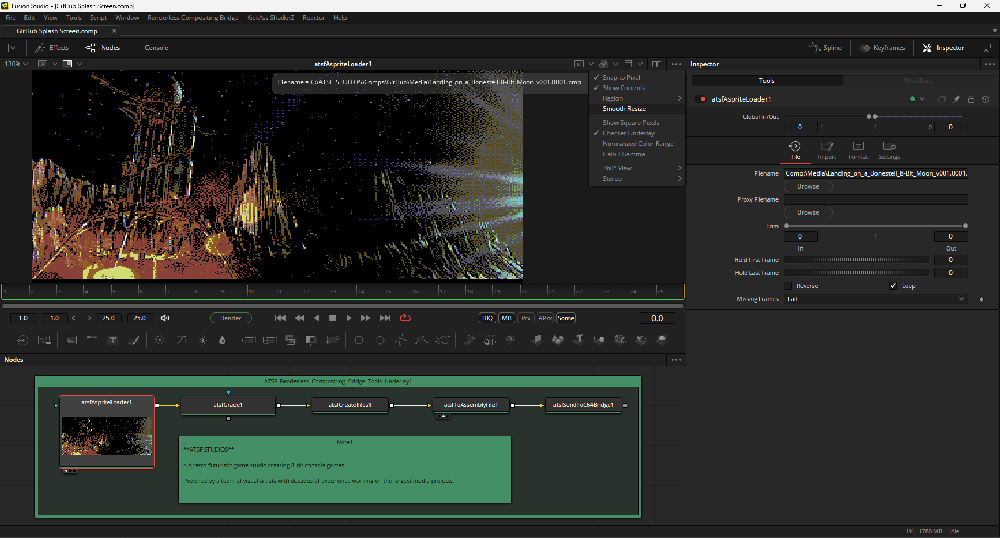
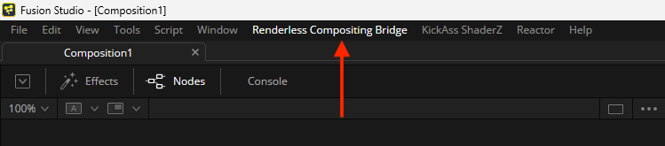

# ATSF Studios' Renderless Compositing Tools

Created by: [Andrew Hazelden](mailto:andrew@andrewhazelden.com)

## Overview

The ATSF team's pipeline automation software provided in this GitHub project is developed for a target market of old-school indie game artists and real-time software developers.

The scripts, plugins, and libraries shipped as part of the renderless compositing toolset allow you to dip your toes into a unique concept that facilitates a seamless in-memory way to bidirectionally bridge your various DCC software's 3D scene-graph and node-based 2D/3D compositing data streams. The goal is to improve artist efficiencies and lower the technical barriers that would otherwise slow the creative team down.

The core idea with a renderless composition task, is to avoid filling disk arrays with intermediate temp files, and proxies, for all of the XPU (CPU + GPU) live-rendered imagery that your DCC apps output to support multi-pass rendering/comp, and 2D sprite based game development efforts.

## Where do I start?

When the ATSF tools are installed, Fusion Studio will display a new "Renderless Compositing Bridge" root-level menu item. This is where the all of settings are configured for the live-link toolset.

Also, the `Reactor:/Deploy/Config/atsf_hotkeys.fu` PathMap is where the custom hotkey bindings are defined. This fusion .fu entry help you control the active Fusion compositing session so it becomes a super-charged retro game design suite.

With only a single button press of the TAB hotkey, your Lightwave3D and Fusion Studio created visuals can be pre-flighted so they instantly run on emulated or real 8-bit era game console hardware with as little fuss as possible. With these techniques at play, everything tends to "just work" like it should... Right out of the box. 

This keeps your art team in the creative flow-zone producing amazing gaming experiences, instead of battling the typical tech issues that working without an efficient end-to-end pipeline causes.

## Free Open-Source License Terms

The toolset is cross-platform compatible and works across Linux, macOS, Windows, iPad/Android tablets, and Commodore 64 BASIC prompt/GEOS environments. The software is released under a permissive free open-source LPG/GPL license. Attribution is required and must be maintained on forks of the project's codebase and scripts. 

## Software Installation

When released officially, the ATSF Renderless Compositing Tools are installed using the free desktop based [Reactor Standalone](https://github.com/Kartaverse/Reactor-Standalone/) package manager application, or the new web-based "[Reactor Anywhere](https://github.com/Kartaverse/Reactor-Standalone/blob/main/Docs/ReactorAnywhere.md)" PWA (Progressive Web App).

Reactor is a package manager created by the [We Suck Less Community](https://www.steakunderwater.com/wesuckless/viewforum.php?f=32). Reactor streamlines the installation of 3rd party content for DCC apps like BMD Fusion Studio and LightWave3D through the use of "Atom" packages that are synced automatically with a Git repository.

